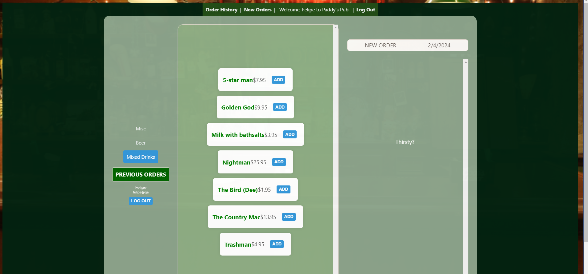
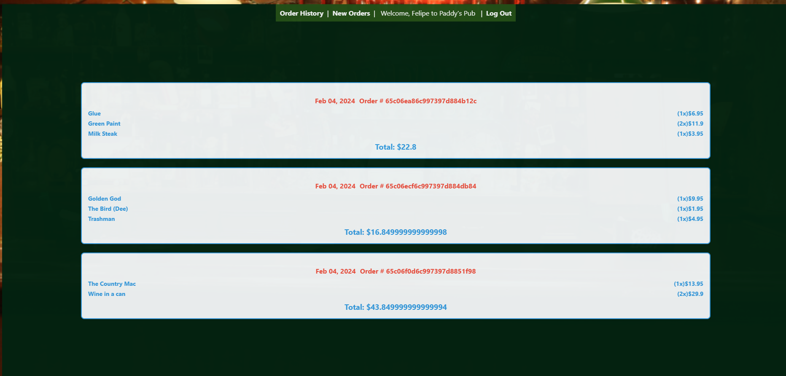

# Paddy's Pub
## Overview
Paddy's Pub is a MERN stack web application that alows users to create orders of drinks that references the hit series "It's Always Sunny in Philadelphia".
## Features
- **User Authentication:** Secure sign-up and login functionalities.
- **CRUD Operations:** Perform Create, Read, Update, and Delete operations on Orders.
- **User-Friendly Interface:** Intuitive design for easy navigation.
- **Deployment:** The app is deployed on Heroku, making it accessible online.
## Planning

## Technologies Used
- MongoDB/Mongoose
- Express
- React
- Node
## Getting started
[Paddy's Pub]()